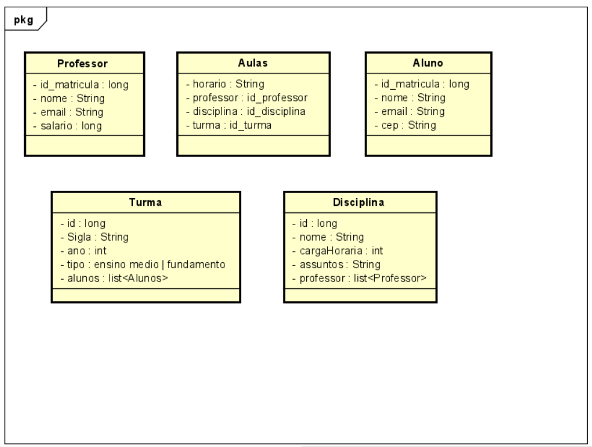

# Sistema de gerencimento de Aulas para Escola

Este Sistema ficara responsavel por ajudar na administracao de aulas quee sera feita por por alunos e turmas de uma escola do ensino fundamental e medio.

## Índice

- [Tecnologias e Ferramentas Utilizadas](#tecnologias-e-ferramentas-utilizadas)
- [Estrutura do Projeto](#estrutura-do-projeto)
- [Pré-requisitos](#pré-requisitos)
- [Instalação e Configuração](#instalação-e-configuração)
- [Execução do Projeto](#execução-do-projeto)

## Tecnologias e Ferramentas Utilizadas

<br>
<div style="display: inline_block" align="center">


</div>
<br>

- ***Linguagem:*** Java

- ***Fremework:*** Spring-Boot 

- ***Banco de Dados:*** PostgreSQL 

- ***ORM:*** Hibernate

- ***Teste De Rotas:*** Postman 
## Estrutura do Projeto

<div align="center" style="display: inline_block">

</div>

<br>

Aqui na imagem vc pode visualizar todas as tabelas no banco de dados que seram ciradas via ORM/Hibernate.JPA que foi utilizada na aplicacao 

## Pré-requisitos

é necessário garantir que seu ambiente de desenvolvimento esteja configurado adequadamente. Aqui estão os principais pré-requisitos:

<br>
<div style="display: inline_block" align="center">


</div>
<br>

- Java Development Kit (JDK): ***versão 8*** ou superior como a ***JDK 11*** recomendada pela documentacao

- Maven ou Gradle: ferramentas de ***build*** para gerenciar ***dependências*** e criar artefatos da aplicação.

- Banco de Dados (SQL or NoSQL): Certifique-se de que o ***PostgreSQL*** ou outros se ja estam instalados e configurados corretamente.

#### IDE (Ambiente de Desenvolvimento Integrado):

<br>
<div style="display: inline_block" align="center">


</div>
<br>

 - ***IntelliJ IDEA*** (com o plugin Spring Boot integrado).
 - ***Eclipse*** (com o plugin Spring Tools Suite - STS).
 - ***VS Code*** (com extensões para Java e Spring Boot)


## Instalação e Configuração

1. **Clone o repositório**:
    ```bash
    git clone https://github.com/seu-repositorio/sistema-gerenciamento-escola.git
    ```
2. **Configuração do banco de dados**:

    - Crie um banco de dados PostgreSQL ou outros.
    - Configure as credenciais de acesso ao banco no arquivo application.properties ou application.yml

        ```bash
        spring.datasource.url=jdbc:postgresql://localhost:5432/nome_do_banco
        spring.datasource.username=seu_usuario
        spring.datasource.password=sua_senha
        spring.jpa.hibernate.ddl-auto=update
        ```

3. **Instalação das dependências**:

    - Se estiver usando Maven:

        ```bash
        mvn clean install
        ```

    - Se estiver usando Gradle:

        ```bash
        gradle build
        ```

## Execução do Projeto

1. **Rodando a aplicação:**

    - Se estiver usando Maven:

        ```bash
        mvn spring-boot:run
        ```

    - Se estiver usando Gradle:

        ```bash
        gradle bootRun
        ```

2. **Acessando a aplicação:**

    <br>
    <div style="display: inline_block" align="center">

    

    </div>
    <br>

    - A aplicação estará rodando em ```http://localhost:8080``` por padrão, OBS :. veeja see na aplicacao nao ah alguma alteracao de porta padrao a ser rodada na aplicacao.

3. **Testando as rotas da API:**

    <br>
    <div style="display: inline_block" align="center">

    

    </div>
    <br>

    - Utilize o Postman para testar as requisições como GET, POST, PUT e DELETE.
